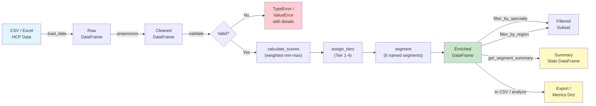

# HCP Segmentation Engine

A Python-based segmentation and targeting engine that scores, tiers, and classifies Healthcare Professionals (HCPs) for pharmaceutical sales teams. Feed it a CSV of HCP data and get back actionable segments like **High-Value KOL**, **Growth Target**, and **Digital Adopter**.

## Overview

Pharma brand and sales-operations teams need to decide, every quarter, **which HCPs to prioritise** and **how many calls each should receive**. This engine turns raw HCP records (prescription volume, visits, digital engagement, KOL status) into a repeatable, auditable targeting plan:

1. **Score** — a weighted composite score (0-100) per HCP.
2. **Tier** — Tier 1 through Tier 4 by prescription volume.
3. **Segment** — one of six named segments (High-Value KOL, Growth Target, Digital Adopter, Standard, Low Activity, Dormant).
4. **Analyse** — RFM scoring for recency/frequency/monetary behaviour.
5. **Track** — segment-migration analysis across two time periods.
6. **Allocate** — distribute an annual call-budget across HCPs based on priority.

Every operation is **immutable** (no in-place mutation of your DataFrames), **deterministic** (same inputs → same outputs), and **covered by pytest** (180+ tests).

## Installation

```bash
# Clone the repo
git clone https://github.com/achmadnaufal/hcp-segmentation-engine.git
cd hcp-segmentation-engine

# (Optional) create a virtualenv
python3 -m venv .venv && source .venv/bin/activate

# Install runtime dependencies
pip install -r requirements.txt
```

Requirements: Python 3.9 or newer, pandas, NumPy, scikit-learn, matplotlib, rich.

## Features

- **Data ingestion** from CSV or Excel (.xlsx/.xls) files
- **Input validation** with clear, actionable error messages and strict type checking
- **Composite scoring** using weighted, min-max normalised prescription volume, revenue, digital engagement, and visit data
- **Tier assignment** (Tier 1-4) based on configurable prescription thresholds
- **Segment classification** into six named segments: High-Value KOL, Growth Target, Digital Adopter, Standard, Low Activity, Dormant
- **Segment summary** reporting per-segment counts and average composite scores
- **Specialty and region filtering** for targeted analysis
- **Full pipeline** from raw data to enriched output in a single method call
- **Immutable design** -- every operation returns a new DataFrame; inputs are never mutated
- **40+ unit tests** with pytest covering helpers, validation, scoring, tiering, segmentation, filtering, analysis, and edge cases

## Quick Start

```bash
# Clone the repo
git clone https://github.com/achmadnaufal/hcp-segmentation-engine.git
cd hcp-segmentation-engine

# Install dependencies
pip install -r requirements.txt

# Run the full pipeline on the demo dataset
python -c "
from src.main import HCPSegmentationEngine

engine = HCPSegmentationEngine()
df = engine.load_data('demo/sample_data.csv')
result = engine.run_full_pipeline(df)
print(result[['hcp_id', 'name', 'composite_score', 'computed_tier', 'computed_segment']].to_string(index=False))
"
```

## Usage

### Full pipeline (one-liner)

```python
from src.main import HCPSegmentationEngine

engine = HCPSegmentationEngine()
df = engine.load_data("demo/sample_data.csv")
result = engine.run_full_pipeline(df)
```

### Step-by-step pipeline

```python
engine = HCPSegmentationEngine()

df        = engine.load_data("demo/sample_data.csv")
cleaned   = engine.preprocess(df)
engine.validate(cleaned)

scored    = engine.calculate_scores(cleaned)
tiered    = engine.assign_tiers(scored)
segmented = engine.segment(tiered)

# Segment distribution summary
summary = engine.get_segment_summary(segmented)
print(summary)

# Filter by specialty or region
cardiologists = engine.filter_by_specialty(segmented, "Cardiology")
northeast     = engine.filter_by_region(segmented, "Northeast")
```

### Custom configuration

```python
custom_config = {
    # Override prescription-volume tier boundaries
    "tier_thresholds": {1: 500, 2: 200, 3: 80, 4: 0},

    # Override composite-score segment cut-offs
    "segment_thresholds": {
        "kol":          75.0,
        "growth":       55.0,
        "digital":      65.0,
        "standard":     25.0,
        "low_activity":  8.0,
    },
}
engine = HCPSegmentationEngine(config=custom_config)
```

### Sample Output

Running the full pipeline on `demo/sample_data.csv` (20 HCP records):

```
hcp_id                name     specialty  composite_score  computed_tier computed_segment
HCP001  Dr. Sarah Mitchell    Cardiology           100.00              1   High-Value KOL
HCP002   Dr. James Okonkwo      Oncology            79.61              1   High-Value KOL
HCP003      Dr. Linda Chen     Neurology            63.11              2    Growth Target
HCP004    Dr. Robert Patel  Primary Care            52.96              2         Standard
HCP005  Dr. Maria Gonzalez Endocrinology            54.45              2  Digital Adopter
HCP006   Dr. Thomas Nguyen    Cardiology            50.66              2  Digital Adopter
HCP007   Dr. Angela Brooks  Rheumatology            40.02              2         Standard
HCP008     Dr. Kevin Walsh      Oncology            39.41              2         Standard
HCP009    Dr. Priya Sharma     Neurology            40.83              2  Digital Adopter
HCP010   Dr. Carlos Rivera  Primary Care            31.85              2         Standard
HCP011    Dr. Emily Foster Endocrinology            36.38              3  Digital Adopter
HCP012  Dr. Marcus Johnson    Cardiology            30.35              3         Standard
HCP013      Dr. Rachel Kim  Rheumatology            28.49              3  Digital Adopter
HCP014 Dr. Daniel Martinez      Oncology            21.31              3     Low Activity
HCP015 Dr. Sophie Anderson     Neurology            19.70              3     Low Activity
HCP016  Dr. Brian Thompson  Primary Care            15.41              4     Low Activity
HCP017    Dr. Laura Wilson Endocrinology            18.10              4     Low Activity
HCP018    Dr. Nathan Davis    Cardiology            11.93              4     Low Activity
HCP019   Dr. Olivia Harris  Rheumatology             4.51              4          Dormant
HCP020     Dr. Michael Lee  Primary Care             0.00              4          Dormant
```

**Segment distribution:**

```
Standard           5
Digital Adopter    5
Low Activity       5
High-Value KOL     2
Dormant            2
Growth Target      1
```

## New: RFM Scorer (Recency / Frequency / Monetary)

Score and rank HCPs on the three classic commercial dimensions of prescribing
behaviour. Each HCP gets a 1-5 quintile per dimension, a concatenated
`rfm_code` (e.g. `"555"` = top tier), a weighted composite `rfm_score`
in `[0, 100]`, and a categorical `rfm_segment` (`Champion`, `Loyal`,
`Casual`, `At Risk`, `Lost`).

### Quick Start

```python
import pandas as pd
from src.rfm_scorer import (
    compute_rfm_scores,
    get_top_hcps,
    summarise_rfm_segments,
)

# 1. Load HCP-level prescribing data
df = pd.read_csv("demo/sample_rfm.csv")

# 2. Score every HCP (reference_date defaults to today)
scored = compute_rfm_scores(df, reference_date="2026-04-18")
print(
    scored[
        ["hcp_id", "recency_days", "r_score", "f_score",
         "m_score", "rfm_code", "rfm_score", "rfm_segment"]
    ].to_string(index=False)
)

# 3. Pull the top 10 HCPs for sales prioritisation
print(get_top_hcps(scored, n=10)[["hcp_id", "rfm_score", "rfm_segment"]])

# 4. Cohort summary (counts and avg score per RFM segment)
print(summarise_rfm_segments(scored))
```

### Step-by-step usage

```python
# Override the default 30/35/35 weighting (recency/frequency/monetary)
custom_weights = {"recency": 0.50, "frequency": 0.25, "monetary": 0.25}
scored = compute_rfm_scores(
    df,
    reference_date="2026-04-18",
    weights=custom_weights,
    last_rx_date_col="last_rx_date",
    rx_count_col="rx_count_90d",
    rx_value_col="total_rx_value_usd",
)

# Filter to actionable cohorts
champions = scored[scored["rfm_segment"] == "Champion"]
at_risk   = scored[scored["rfm_segment"] == "At Risk"]
```

### Required input columns

| Column | Type | Description |
|---|---|---|
| `hcp_id` | str | HCP identifier |
| `last_rx_date` | date / str | Date of HCP's most recent prescription |
| `rx_count_90d` | int | Prescription count in the analysis window |
| `total_rx_value_usd` | float | Prescription dollar value in the same window |

Missing dates default to `reference_date` (recency = 0); missing numerics
are treated as zero. Single-HCP, all-zero, and zero-variance inputs are
gracefully handled by assigning the median quintile (3).

## New: Segment Migration Analyzer

Track how HCPs move between segments across two time periods — surface upgrades, downgrades, and churn risk without modifying your original data.

### Step-by-step usage

```python
import pandas as pd
from src.segment_migration_analyzer import (
    compute_migration_table,
    build_migration_matrix,
    summarise_migrations,
)

# Period A — output of run_full_pipeline() for Q1
df_q1 = engine.run_full_pipeline(engine.load_data("data/q1_hcps.csv"))

# Period B — output of run_full_pipeline() for Q2
df_q2 = engine.run_full_pipeline(engine.load_data("data/q2_hcps.csv"))

# 1. Per-HCP transition table (inner-joins on hcp_id)
migration = compute_migration_table(df_q1, df_q2)
print(migration[["hcp_id", "segment_before", "segment_after", "direction", "churn_risk_score"]])

# 2. Segment-to-segment matrix (counts)
matrix = build_migration_matrix(migration)
print(matrix)

# 3. Normalised matrix (row fractions — where did each segment go?)
matrix_pct = build_migration_matrix(migration, normalise=True)
print(matrix_pct)

# 4. Cohort-level summary statistics
stats = summarise_migrations(migration)
print(f"Upgraded:   {stats['upgraded']}  ({stats['pct_upgraded']}%)")
print(f"Downgraded: {stats['downgraded']}  ({stats['pct_downgraded']}%)")
print(f"Churned:    {stats['churned']}  ({stats['pct_churned']}%)")
print(f"Top churn-risk HCPs: {stats['top_churn_risk_hcps']}")
```

### What you get

| Column / Key | Description |
|---|---|
| `direction` | `"upgrade"`, `"downgrade"`, or `"stable"` |
| `rank_delta` | Signed rank change (positive = moved up the value ladder) |
| `is_churned` | `True` when the HCP ended the period as `"Dormant"` |
| `churn_risk_score` | Normalised rank drop in [0, 1] — larger = higher risk |
| `pct_upgraded` | Cohort-level percentage that improved segment |
| `top_churn_risk_hcps` | Up to 5 HCP IDs most at risk of full churn |

Segments are ranked in priority order: `Dormant` → `Low Activity` → `Standard` → `Digital Adopter` → `Growth Target` → `High-Value KOL`.

## New: Calling Plan Allocator

Turn a segmented HCP cohort and a fixed annual call-budget into a per-HCP allocation that respects segment priorities, minimum and maximum call caps, and conserves the total budget exactly.

### Quick Start

```python
from src.main import HCPSegmentationEngine
from src.calling_plan_allocator import (
    calculate_priority_score,
    allocate_calls,
    summarise_allocation,
)

engine = HCPSegmentationEngine()
segmented = engine.run_full_pipeline(engine.load_data("demo/sample_data.csv"))

# 1. Compute a 0-100 priority score blending composite + segment weight
prioritised = calculate_priority_score(segmented)

# 2. Distribute a 300-call annual budget across all HCPs
plan = allocate_calls(
    segmented,
    total_calls_budget=300,
    min_calls_per_hcp=0,
    max_calls_per_hcp=36,
)
print(plan[["hcp_id", "computed_segment", "priority_score", "allocated_calls"]])

# 3. Segment-level summary
print(summarise_allocation(plan))
```

### Methodology

1. **Priority score** — `priority = composite_score * blend + segment_weight * 100 * (1 - blend)` (default blend = 0.6). High-Value KOLs get weight 1.00, Dormant 0.05.
2. **Seed** — each HCP starts at their segment's target cadence (KOL = 24/yr, Growth = 18/yr, Digital = 12/yr, Standard = 8/yr, Low Activity = 4/yr, Dormant = 0/yr).
3. **Scale** — seeds are proportionally scaled so the total matches the requested budget.
4. **Nudge** — up to 20% of each segment's allocation is redistributed toward higher-priority HCPs within the segment.
5. **Cap & round** — values are clipped to `[min_calls_per_hcp, max_calls_per_hcp]`, rounded to int, and any ±1 rounding drift is settled against the highest-priority HCPs so the budget sums exactly.

### Example Output

```
 hcp_id computed_segment  priority_score  allocated_calls
 HCP001   High-Value KOL           95.20               36
 HCP002   High-Value KOL           87.76               36
 HCP003    Growth Target           75.86               27
 HCP004    Growth Target           71.78               25
 HCP005  Digital Adopter           58.67               17
 ...
```

Edge cases handled: empty DataFrame, zero budget, single HCP, identical priorities, NaN composite scores, budgets exceeding total per-HCP capacity.

## Tech Stack

| Tool | Purpose |
|------|---------|
| **Python 3.9+** | Core language |
| **pandas** | Data manipulation and pipeline |
| **NumPy** | Numerical operations and normalisation |
| **pytest** | Unit testing (40+ tests, 80%+ coverage) |
| **scikit-learn** | Available for future ML-based segmentation |
| **Rich** | Terminal formatting (optional) |

## Architecture



**Pipeline stages:**

1. **Ingest** -- Load HCP records from CSV or Excel via `load_data()`
2. **Clean** -- Standardise column names, drop null rows, fill missing numerics with medians via `preprocess()`
3. **Validate** -- Assert required columns exist, dataset is non-empty, and input types are correct via `validate()`
4. **Score** -- Compute a weighted composite score (0-100) from prescription volume, Rx value, digital engagement, and visits via `calculate_scores()`
5. **Tier** -- Assign Tier 1-4 based on configurable prescription volume thresholds via `assign_tiers()`
6. **Segment** -- Classify each HCP into one of six actionable segments via `segment()`
7. **Summarise / Filter / Export** -- Aggregate segment stats, slice by specialty or region, export or analyse results

## Project Structure

```
hcp-segmentation-engine/
├── src/
│   ├── __init__.py
│   ├── main.py                       # Core engine: scoring, tiering, segmentation
│   ├── rfm_scorer.py                 # Recency / Frequency / Monetary scoring
│   ├── segment_migration_analyzer.py # Cross-period segment migration + churn risk
│   ├── calling_plan_allocator.py     # Budget-constrained call allocation
│   └── data_generator.py             # Synthetic data generator
├── tests/
│   ├── __init__.py
│   ├── test_segmentation.py              # HCPSegmentationEngine tests
│   ├── test_rfm_scorer.py                # RFM scorer tests
│   ├── test_segment_migration_analyzer.py# Segment migration tests
│   └── test_calling_plan_allocator.py    # Calling-plan allocator tests
├── demo/
│   ├── sample_data.csv      # 20-row realistic HCP dataset (extended columns)
│   └── sample_rfm.csv       # 18-row RFM sample dataset
├── sample_data/             # Alternate location for the same samples
├── examples/
│   └── basic_usage.py       # Runnable usage example
├── data/                    # Drop real data here (gitignored)
├── requirements.txt
├── CHANGELOG.md
├── LICENSE
└── README.md
```

## Running Tests

```bash
# Run all tests
pytest tests/ -v

# Run with coverage report
pytest tests/ -v --cov=src --cov-report=term-missing
```

Expected output:

```
tests/test_segmentation.py::TestHelperFunctions::test_normalise_columns_lowercases PASSED
tests/test_segmentation.py::TestHelperFunctions::test_min_max_normalise_standard PASSED
tests/test_segmentation.py::TestEngineInit::test_default_config_uses_module_constants PASSED
tests/test_segmentation.py::TestValidation::test_validate_raises_on_empty_dataframe PASSED
tests/test_segmentation.py::TestValidation::test_validate_passes_with_required_columns PASSED
tests/test_segmentation.py::TestPreprocessing::test_preprocess_drops_fully_null_rows PASSED
tests/test_segmentation.py::TestScoreCalculation::test_composite_score_range PASSED
tests/test_segmentation.py::TestTierAssignment::test_all_tier_boundaries PASSED
tests/test_segmentation.py::TestSegmentation::test_kol_high_value_segment PASSED
tests/test_segmentation.py::TestFullPipeline::test_full_pipeline_produces_all_columns PASSED
...
================================ 40+ passed in 0.xx s ================================
```

## License

[MIT](LICENSE)

> Built by [Achmad Naufal](https://github.com/achmadnaufal) | Lead Data Analyst | Power BI · SQL · Python · GIS
