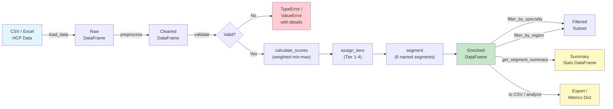

# HCP Segmentation Engine

A Python-based segmentation and targeting engine that scores, tiers, and classifies Healthcare Professionals (HCPs) for pharmaceutical sales teams. Feed it a CSV of HCP data and get back actionable segments like **High-Value KOL**, **Growth Target**, and **Digital Adopter**.

## Features

- **Data ingestion** from CSV or Excel (.xlsx/.xls) files
- **Input validation** with clear, actionable error messages and strict type checking
- **Composite scoring** using weighted, min-max normalised prescription volume, revenue, digital engagement, and visit data
- **Tier assignment** (Tier 1-4) based on configurable prescription thresholds
- **Segment classification** into six named segments: High-Value KOL, Growth Target, Digital Adopter, Standard, Low Activity, Dormant
- **Segment summary** reporting per-segment counts and average composite scores
- **Specialty and region filtering** for targeted analysis
- **Full pipeline** from raw data to enriched output in a single method call
- **Immutable design** -- every operation returns a new DataFrame; inputs are never mutated
- **40+ unit tests** with pytest covering helpers, validation, scoring, tiering, segmentation, filtering, analysis, and edge cases

## Quick Start

```bash
# Clone the repo
git clone https://github.com/achmadnaufal/hcp-segmentation-engine.git
cd hcp-segmentation-engine

# Install dependencies
pip install -r requirements.txt

# Run the full pipeline on the demo dataset
python -c "
from src.main import HCPSegmentationEngine

engine = HCPSegmentationEngine()
df = engine.load_data('demo/sample_data.csv')
result = engine.run_full_pipeline(df)
print(result[['hcp_id', 'name', 'composite_score', 'computed_tier', 'computed_segment']].to_string(index=False))
"
```

## Usage

### Full pipeline (one-liner)

```python
from src.main import HCPSegmentationEngine

engine = HCPSegmentationEngine()
df = engine.load_data("demo/sample_data.csv")
result = engine.run_full_pipeline(df)
```

### Step-by-step pipeline

```python
engine = HCPSegmentationEngine()

df        = engine.load_data("demo/sample_data.csv")
cleaned   = engine.preprocess(df)
engine.validate(cleaned)

scored    = engine.calculate_scores(cleaned)
tiered    = engine.assign_tiers(scored)
segmented = engine.segment(tiered)

# Segment distribution summary
summary = engine.get_segment_summary(segmented)
print(summary)

# Filter by specialty or region
cardiologists = engine.filter_by_specialty(segmented, "Cardiology")
northeast     = engine.filter_by_region(segmented, "Northeast")
```

### Custom configuration

```python
custom_config = {
    # Override prescription-volume tier boundaries
    "tier_thresholds": {1: 500, 2: 200, 3: 80, 4: 0},

    # Override composite-score segment cut-offs
    "segment_thresholds": {
        "kol":          75.0,
        "growth":       55.0,
        "digital":      65.0,
        "standard":     25.0,
        "low_activity":  8.0,
    },
}
engine = HCPSegmentationEngine(config=custom_config)
```

### Sample Output

Running the full pipeline on `demo/sample_data.csv` (20 HCP records):

```
hcp_id                name     specialty  composite_score  computed_tier computed_segment
HCP001  Dr. Sarah Mitchell    Cardiology           100.00              1   High-Value KOL
HCP002   Dr. James Okonkwo      Oncology            79.61              1   High-Value KOL
HCP003      Dr. Linda Chen     Neurology            63.11              2    Growth Target
HCP004    Dr. Robert Patel  Primary Care            52.96              2         Standard
HCP005  Dr. Maria Gonzalez Endocrinology            54.45              2  Digital Adopter
HCP006   Dr. Thomas Nguyen    Cardiology            50.66              2  Digital Adopter
HCP007   Dr. Angela Brooks  Rheumatology            40.02              2         Standard
HCP008     Dr. Kevin Walsh      Oncology            39.41              2         Standard
HCP009    Dr. Priya Sharma     Neurology            40.83              2  Digital Adopter
HCP010   Dr. Carlos Rivera  Primary Care            31.85              2         Standard
HCP011    Dr. Emily Foster Endocrinology            36.38              3  Digital Adopter
HCP012  Dr. Marcus Johnson    Cardiology            30.35              3         Standard
HCP013      Dr. Rachel Kim  Rheumatology            28.49              3  Digital Adopter
HCP014 Dr. Daniel Martinez      Oncology            21.31              3     Low Activity
HCP015 Dr. Sophie Anderson     Neurology            19.70              3     Low Activity
HCP016  Dr. Brian Thompson  Primary Care            15.41              4     Low Activity
HCP017    Dr. Laura Wilson Endocrinology            18.10              4     Low Activity
HCP018    Dr. Nathan Davis    Cardiology            11.93              4     Low Activity
HCP019   Dr. Olivia Harris  Rheumatology             4.51              4          Dormant
HCP020     Dr. Michael Lee  Primary Care             0.00              4          Dormant
```

**Segment distribution:**

```
Standard           5
Digital Adopter    5
Low Activity       5
High-Value KOL     2
Dormant            2
Growth Target      1
```

## Tech Stack

| Tool | Purpose |
|------|---------|
| **Python 3.9+** | Core language |
| **pandas** | Data manipulation and pipeline |
| **NumPy** | Numerical operations and normalisation |
| **pytest** | Unit testing (40+ tests, 80%+ coverage) |
| **scikit-learn** | Available for future ML-based segmentation |
| **Rich** | Terminal formatting (optional) |

## Architecture



**Pipeline stages:**

1. **Ingest** -- Load HCP records from CSV or Excel via `load_data()`
2. **Clean** -- Standardise column names, drop null rows, fill missing numerics with medians via `preprocess()`
3. **Validate** -- Assert required columns exist, dataset is non-empty, and input types are correct via `validate()`
4. **Score** -- Compute a weighted composite score (0-100) from prescription volume, Rx value, digital engagement, and visits via `calculate_scores()`
5. **Tier** -- Assign Tier 1-4 based on configurable prescription volume thresholds via `assign_tiers()`
6. **Segment** -- Classify each HCP into one of six actionable segments via `segment()`
7. **Summarise / Filter / Export** -- Aggregate segment stats, slice by specialty or region, export or analyse results

## Project Structure

```
hcp-segmentation-engine/
├── src/
│   ├── __init__.py
│   ├── main.py              # Core engine: scoring, tiering, segmentation
│   └── data_generator.py    # Synthetic data generator
├── tests/
│   ├── __init__.py          # Makes tests a proper Python package
│   └── test_segmentation.py # pytest unit tests (40+ tests, 9 classes)
├── demo/
│   └── sample_data.csv      # 20-row realistic HCP dataset (extended columns)
├── sample_data/
│   └── sample_data.csv      # Lightweight sample for quick testing
├── examples/
│   └── basic_usage.py       # Runnable usage example
├── data/                    # Drop real data here (gitignored)
├── requirements.txt
├── CHANGELOG.md
├── LICENSE
└── README.md
```

## Running Tests

```bash
# Run all tests
pytest tests/ -v

# Run with coverage report
pytest tests/ -v --cov=src --cov-report=term-missing
```

Expected output:

```
tests/test_segmentation.py::TestHelperFunctions::test_normalise_columns_lowercases PASSED
tests/test_segmentation.py::TestHelperFunctions::test_min_max_normalise_standard PASSED
tests/test_segmentation.py::TestEngineInit::test_default_config_uses_module_constants PASSED
tests/test_segmentation.py::TestValidation::test_validate_raises_on_empty_dataframe PASSED
tests/test_segmentation.py::TestValidation::test_validate_passes_with_required_columns PASSED
tests/test_segmentation.py::TestPreprocessing::test_preprocess_drops_fully_null_rows PASSED
tests/test_segmentation.py::TestScoreCalculation::test_composite_score_range PASSED
tests/test_segmentation.py::TestTierAssignment::test_all_tier_boundaries PASSED
tests/test_segmentation.py::TestSegmentation::test_kol_high_value_segment PASSED
tests/test_segmentation.py::TestFullPipeline::test_full_pipeline_produces_all_columns PASSED
...
================================ 40+ passed in 0.xx s ================================
```

## License

[MIT](LICENSE)

> Built by [Achmad Naufal](https://github.com/achmadnaufal) | Lead Data Analyst | Power BI · SQL · Python · GIS
